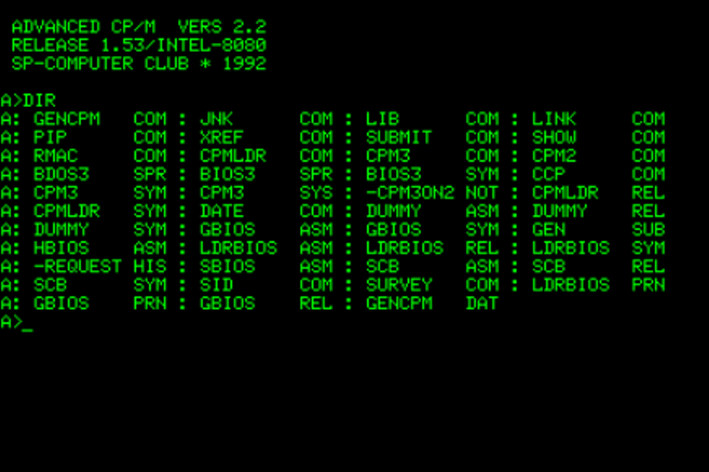
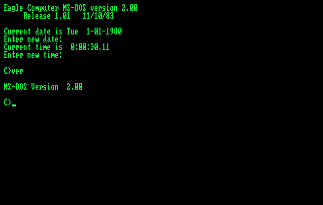
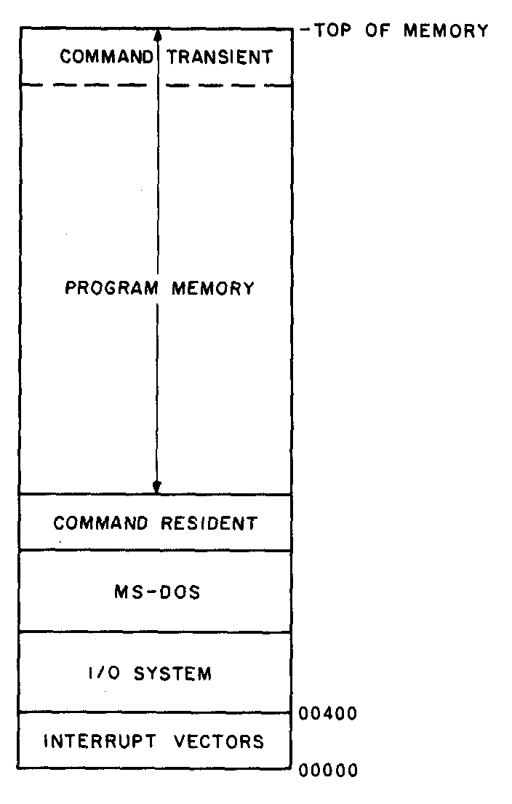

# CP/M, xx-DOS, и их .COMманды

Небольшое предупреждение! Эта статья содержанием немного не удовлетворяет смыслу переданному в заголовке. Я буду говорить не просто о том "Как запускаются комманды?", а покажу часть внутреннего мира операционных систем и покажу принципиальную разницу в их работе.

Это моя первая статья, вырванная из моего дневника, который я веду пока что закрыто, особо не выкладывая заметки в публичный доступ.


### Взгляд на CP/M

Начну очень издалека, поскольку
считаю важным немного заранее обозначить моменты, которые будут нужны.

Во времена 1970-ых годов, когда для процессоров Intel 8080 появилась на свет операционная система CP/M (полн. "Computer Program/Monitor").



Процессор i8080 (полн. "Intel 8080") был 8-разрядным,
соответственно объемы обрабатываемой памяти были не такими уж и большими. Все написанные под эту ОС программы помещались в один файл комманды и весили _не больше чем 64Кб_.

Раз глава про управление памятью, сразу вижу необходимым обозначить структуру оперативной памяти после загрузки CP/M.

```
+----------------------------+ <-- 0xFFFF
|           BIOS             |        
| Аппаратные драйвера BDOS   |
+----------------------------+ <-- 0xF200
|           BDOS             |
| CP/M двоичный интерфейс    |
+----------------------------+ <-- 0xE400
|   Интерпретатор комманд    |
+----------------------------+ <-- 0xDC00
|           TPA              | 
|Область запущенной программы|
+----------------------------+ <-- 0x0100
|        LowMem Storage      |
| То, что нас интересует     |
+----------------------------+ <-- 0x0000
```

Объясняю по-порядку все, что может вогнать в тупик:

> `BDOS` (полн. "Basic Disk Operating System") - это лишь часть CP/M, а не второе название системы. 

Компонент `BDOS` действительно для первого раза лучше принять за двоичный интерфейс, так как комманды `CLOSE`, `READ`, `SELECT`, и др, это "именно в эту дверь".

> `BIOS` (полн. " Basic Input/Output System") это буквально то, о чём могут подумать практически все, кто это читает. **Но** сразу обозначусь, в понимании CP/M это её часть, а не отдельное "нечто" и POST.

Выглядит немного необычно, не так ли?
Интересно в организации ОЗУ самое первое (или последнее) пространство -- "Low Memory Storage".
Низкоуровневая память или "Low Memory Storage"
бьется на разделы тоже. 

На самом деле, эту часть лучше пропустить, поскольку много кого это загонит в тупик.
Я оставлю информацию, которую я нашел в архивах, но лучше пропустить это мимо глаз. 

```
+----------------------------+ <-- 0xFF
|       Файловый буфер       | <-- 0x80 длинна
|                            |     0x81-0xFF
|                            | Список ASCII строк
+----------------------------+
| FCB (File Control Block)   |
+----------------------------+
| ???                        |
+----------------------------+
| BIOS рабочее пространство  |
+----------------------------+
| Вектор перезагрузки #7     | <-- Использовался 
| Вектор перезагрузки #6     |     отладчиком
| .                          |
| .                          |
| Вектор перезагрузки #1     |     
+--------+------+----+-------+     
|   F200 | Disk | IO | E400  | 
+--------+------+----+-------+ <-- 0x00
```

### ... и взгляд CP/M на Программы

И так, программа для `CP/M` это файл с расширением "`.COM`". 

> Файл "`.COM`" (сокр. "Command") - это монолит кода. Внутри он никак не разграничен и не имеет опознавательных знаков или подписей. В CP/M может занимать адреса до верней границы TPA (полн. "Transistent Program Area"). 

Напишем ~с Божьей помощью~ простой пример комманды, чтобы показать структуру:

```asm
.z80               ; <-- Требуется Z80;

WRITE       equ 9h ; <-- CP/M функционал;
_BDOS       equ 5h ; <-- "Системное прерывание";

org 100h           ; <-- Отступ в ОЗУ на 255 байт;
    ld C, WRITE
    ld DE, hello
    call _BDOS     ; syscall;
    rst 0h         ; Выход.

hello:
    db "Hello World!$"
    end
```

На всякий случай, комманда `ld` (полн. "LOAD") выполняется как `mov` из IA-32, а не как `lea` или `push`. Комманда `rst` (полн. "RESET") cбрасывает значение стэка. 

Стрелочками в комментариях я обозначил, что здесь определенно "делает погоду".
Для `CP/M` в структуре программы есть три
немало важные детали. 
1. требование к архитектуре;
2. двоичный интерфейс (англ. "Application Binary Interface") системы;
3. смещение программы (`ORG 100h`) и установка входной точки.

```
     Начало TPA -->|
                   |
<-- Low Memstr  -->|
+------------------+-----------------+
| ... | ... | ...  | Код программы   |
+------------------+-----------------+
|<--  255 байт  -->|                 |

```

Сама программа **должна будет** лежать в области TPA, как из таблицы видно, а выделенная область оказывается лежит в Low Memry Storage. 
Эта таблица называется `ZPCB` (полн. "Zero Page Control Block") или `PPA` (полн. "Program Prefix Area") для поздних релизов этой системы.

Представьте себе почтовый ящик в подъезде по таковому адресу (адрес `0x0000-0x00FF` это Low Memory Storage)... Когда приходит жилец (загружается комманда), почтальон (Операционная Система `CP/M`) кладет в этот ящик конверт с важной информацией именно для этого жильца. Конверт лежит в ящике. Жилец приходит "домой" (загружается по 0x0100 смещению) и первым делом заглядывает в свой ящик за конвертом (Содержит области памяти ещё и `ZPCB`).


### Загрузка и регистрация .COMманды в CP/M

Когда CP/M загружает .COM файл
ОС инициализирует PPA/ZPCB в Low Storage. Она заполняет поля, относящиеся к запуску программы. Это могут быть текущий диск, `FCB1`, `FCB2`, хвост командной строки, системные векторы `BDOS` и `BIOS` для этого запуска.

ОС загружает бинарный образ .COM файла начиная с адреса 0x0100. Именно благодаря `ORG 100h` комманде процессору. 
Код программы ожидает, что по 0x0000-0x00FF уже лежит корректно заполненная PPA.

ОС устанавливает регистры процессора: `PC` (полн. "Program Counter") становится по адресу точки входа, `SP` (полн. "Stack Pointer") - обычно глядит в конец доступной программе памяти (или в другое место, указанное в `BDOS`).

### Zero Page Control Block или Program Prefix Area (CP/M)

Теперь более детально опишу структуру ZPCB/PPA. В документации к `CP/M` её действительно называют "нулевой страницей", поэтому непобоюсь написать так же.

Данную структуру в более полном виде (описания и типы данных) можно найти в архивах или на сайте с документацией.

| Название поля          | Размерность | Описание                |
|------------------------|-------------|-------------------------|
| `bCodeGroupLength`     | `[u8; 3]`   |                         |
| `bCodeGroupAddress`    | `size`      | Адрес сегмента кодовой группы |
| `b8080Flag`            | `u8`        | Установлен, если программа в одном сегменте |
| `bDataGroupLength`     | `size`      | |
| `bReserved`            | `u8`        |                         |
| `hExtraGroup`          | | |
| `hGroupX1`             | `[u8; 5]`   | Дескриптор группы `X1`  | 
| `hGroupX2`             | `[u8; 5]`   | Дескриптор группы `X2`  |
| `hGroupX3`             | `[u8; 5]`   | Дескриптор группы `X3`  |
| `hGroupX4`             | `[u8; 5]`   | Дескриптор группы `X4`  |
| `bReserved`            | `[u8; 11]`  |   |
| `bTargetFloppy`        | `size`      | Диск с которого запущена программа |
| `bFcbPasswordAddress`  | `u8`        | Адрес ключевого слова для `FCB #1` |
| `bFcbPasswordLength`   | `u8`        | Длинна ключевого слова |
| `dwReserved`           | `u32`       | |
| `bDefaultFcb`          | `[u8; 15]`  | `FileControl Block` #1 |
| `bFcb`                 | `[u8; 14]`  | `FileControl Block` перезаписывается, если открыт FCB #1 |
| `bArgc`                | `u8`        | Количество аргументов |
| `bArgv`                | `[u8; 127]` | Аргументы командного интерпретатора |
 
Теперь укажу условные обозначениям:
 - Префикс `b...` - это `BYTE` или машинное слово, размером в 8 бит.
 - Префикс `h...` - это дескриптор (указатель) инкапсулирущий настоящий адрес данных.
 - Нотация `[type; n]` взята из Rust, так как нахожу это правило универсальными и более понятными глазу, чем типы данных Windows. Это массив `type`-ячеек в `n`-ом колличестве.
 - Префикс `dw...` - это `DWORD`, а не `define WORD`! Другими словами - машинное слово размером в 32-бит (на момент IA-32e).
 - Тип данных `size` тоже взят из Rust. Путь Этот тип будет для всех, как максимально возможное машинное слово для процессоров тех времен и самой ОС. (имеется ввиду `Intel 8080` и `Intel 8086`). Все зависит только от того "Где работает ОС и какая ОС".

Как видно, тот самый "конверт" с письмом на самом деле содержит вот такие поля данных.

Очень важно запомнить, что таблица `PPA` в `CP/M`
**только одна**. Она располагается в **определенном месте**,
имеет очень большой смысл в жизненном цикле программы.

Только в CP/M-86, `ZPCB` (или `PPA`) начинает поведением быть похожа на PSP таблицу из `xx-DOS`.

### Взгляд на xx-DOS
Сейчас речь пойдет в основном про `PC-DOS` и `MS-DOS 2.0`,
так как тема разговора и подопытные совпадают.



В предыдущей главе было описано более-менее подробно, как же понимает CP/M файлы комманд. Раз уж выделена отдельная глава для DOS, логично предположить, что поведение `COM`
файлов в DOS и CP/M разное.

Внимание, здесь не будет описан механизм чтения `OVERLAY`
частей программ, потому что рассматриваются немного другие времена
и лишние объяснения про страницы памяти будет избыточно.

К сожалению опять собираются грозовые тучи теории и истории, и придется их переждать, ведь без них всё высохнет и потеряет смысл.

Очень важная отличительная черта от предыдущего "подопытного" в организации процессов. Положим, `MS-DOS` пусть и является однозадачной, по определению, но каким-то образом же может удерживать драйверы и DOS-extender'ы? Ведь да?

В оперативной памяти `DOS` держится приблизительно таким образом:



Здесь логика местами похожа на `CP/M`, но в глаза бросается строгое разграничение программной памяти. Отныне все нулевые страницы ~управляемой~ памяти пренадлежат области "Program Memory".

Писать про жизненно необходимые `MSDOS.SYS`, `CONFIG.SYS`, `COMMAND.COM` не буду. Они как раз видны на схеме вооруженным глазом. 

### ...и Взгляд xx-DOS на программы

Для 16-разрядных DOS при выполнении файла код, 
данные и стек находятся в одном и том же 16-битном сегменте. 
Поэтому размер файла не может превышать 65280 байт (что на 256 байт меньше размера сегмента — или 216 байт).

Простейшая программа для DOS на Flat Assembly (сокр. "FASM")
диалекте выглядит приблизительно так:

```asm
use16

DosWrite equ 9h     ;<-- Функционал DOS/2.0

org 100h            ;<-- Точка входа 0x100
    mov dx, hello
    mov ah, DosWrite;DOS call.
    int 21h         ;syscall. (вызов DOS функции)
 
    mov ax, 4C00h   ;AH = 4Ch, AL = 00h.
    int 21h         ;syscall (вызов DOS функции)

hello db 'Hello, world!$'
```

Стрелочками я обозначил практически те же самые места, такие как смещение и обозначение точки входа (не смещение точки входа), и ABI системы. С виду структурно это похоже на предыдущий образец. Разница только в архитектуре и в системном BI ~(просто убрал ненужную букву)~.

Впринципе, отличить `.COM`ы можно только при детальном анализе  сырого содержимого, так как дисковых операционных систем успело 
появиться достаточно, и ~скорее всего~ системный интерфейс у всех отличается. Можно ловить их по опкодам прерываний, как делал это я, можно придумать более умную стратегию.

### Загрузка регистрация .COMманд в MS-DOS 2

И так, идея комманды не меняется. `.COM` это все еще PIE-монолит (исполняемый файл независящий от точки входа).

При загрузке файла `.COM` в свободной области ОЗУ, операционная система
создает несколько структур.
Структура "перед" кодом программы - это `PSP` (полн. "Program Segment Prefix"), что отвечает за состояния
выполняемого файла и предоставляет список аргументов командной строки.

```
A:\> COMMAND.COM /A /B /C
argv[     0     ][1][2][3]
```

В области ОЗУ будет приблизительно такая схема ячеек:

```
+-----+-----+----------+----------------------------------+-----+
| ... | ... | PSP      | [Программа] [STACK]              | ... |
+-----+-----+----------+----------------------------------+-----+
            | 256 байт |         Размер Программы         |
            |                                             |
            |                                             |
 Начало  -->|                  Конец области программы -->|
```

Как видно из таблицы, именно поэтому образец программы начинался с `org 100h`.

Сама программа в ОЗУ разбивается по области кода, данных и стэка.
Ещё раз: здесь не рассматривается `OVERLAY` части, потому что это здесь избыточно.
Но в следующий раз, возможно про `.EXE` файлы и `MS-DOS 2.0` я это обязательно возьмусь показательно разбирать.

В документации `DOS` я не встретил упоминания "нулевой страницы", поэтому назову структуру "как есть".

### Program Segment Prefix (PSP)

Теперь спускаемся ещё дальше в специфику DOS и CP/M семейств.
С первых интернет ресурсов буквально представляется полная информация о `PSP` секции. Представлена ниже:

| Название          | Размер        | Описание |
|-------------------|---------------|----------|
| `wExitCode`       | `u16`         | `INT 0x20` код выхода программы |
| `wSegmentAddress` | `u16`         | Сегмент расположенный после выделенной памяти |
| `bReserved`       | `u8`          | |
| `bCallFar`        | `[u8; 5]`     | Содержит `CALL` для вызодва функции `DOS` |
| `hTerminate`      | `u32`         | Адрес `TERMINATE` обработчика |
| `hBreak`          | `u32`         | Адрес `BREAK` обработчика |
| `hException`      | `u32`         | Адрес обработчика ошибок  |
| `wParentSegment`  | `size`        | Сегмент PSP процесса-родителя |
| `JobFileTable`    | `[u8; 20]`    | Общее расположение пространства памяти |
| `wEnvironment`    | `size`        | Сегмент переменных среды |
| `dwSsSp`          | `u32`         | Маска вида `SS:SP` для входа к последнему вызову `INT 0x21` |
| `wMaxFilesOpened` | `u16`         | Максимальное количество открытых файлов |
| `hRecords`        | `u32`         | Адрес обработчика ручных записей |
| `bReserved`       | `[u8; 24]`    | |
| `bInterruptOpcode`| `u8`          | Опкод прерывания (`INT => 0xCD`) |
| `wInterruptCode`  | `u16`         | Номер прерывания. |
| `bReserved`       | | |
| `wFirstFcb`       | `u16`         | Первый закрытый `FileControl block` уровень |
| `wNextFcb`        | `u16`         | Перезаписывается, если открыт `wFirstFcb` |
| `cbArg`           | `u8`          | Колличество аргументов коммандной строки |
| `bArg`            | `[u8; 127]`   | Аргументы коммандной строки. **Всегда** заканчивается на `0x0D` |

В CP/M и DOS главах упомянались `FileControl`-блоки, но почему-то ни слуху - ни духу, о них в разборе... Исправляюсь.

Специально выделю два ~водораздела~ подраздела для неизвестных структур.

### File Control Block (FCB)

FCB (File Control Block) в DOS — структура, в которой поддерживается состояние открытого файла. Она находится внутри памяти программы, которая использует файл, а не в памяти операционной системы. 
Такое решение позволяет процессу иметь одновременно несколько файлов, если он может выделить достаточно памяти для FCB на каждый файл

В зависимости от версии `MS-DOS` сама структура потерпела изменения:
Я показываю структуру FCB такой, какая она есть в `MS-DOS 2.0`, поскольку там присутствуют поля случайного доступа.

```cpp
#pragma pack(push, 1)
struct FCB_STANDARD {
    unsigned char drive;        // 00: 0 = default, 1=A, 2=B, ...
    char filename[8];           // 01-08: имя файла (лево выровнено, пробелы в конце)
    char extension[3];          // 09-0B: расширение (лево выровнено, пробелы)
    unsigned short current_block; // 0C-0D: текущий блок (начиная с 0)
    unsigned short record_size;   // 0E-0F: размер логической записи в байтах
    unsigned long file_size;      // 10-13: размер файла в байтах
    unsigned short date;          // 14-15: дата (формат: см. выше)
    unsigned short time;          // 16-17: время (формат: см. выше)
    unsigned char reserved[8];    // 18-1F: зарезервировано (зависит от версии)
    unsigned char current_record; // 20:   текущая запись в блоке (0-127)
    
    // MS-DOS 1.25 не имеет поля случайных записей
    unsigned long random_record;  // 21-24: случайная запись (относительно начала файла)
}
#pragma pack(pop)
```

У блока управления файлом в `DOS 2.0` есть расширенный (мне кажется лучше расширяющий) подраздел.

```c
#pragma pack(push, 1)
struct FCB {
    unsigned char signature;     // -7: 0xFF
    unsigned char reserved[5];   // -6 - -2: зарезервировано
    unsigned char attribute;     // -1: атрибут файла
    FCB_STANDARD fcb;             // 00-24: стандартный FCB
}
#pragma pack(pop)
```

Советую думать, что `FCB` это своеобразная карточка книги в библиотеке,
а расширенный FCB это пометка [СЕКРЕТНО]. Увы, подробнее об этом в другой раз.

### Таблицы процесса (JFT и SFT)

> Изначально этот материал я долго не мог уложить в голове, и взял его практически "как есть", без обработки. Но со временем дополнения появились.

Для обеспечения доступа к открытым файлам `MS-DOS` использует системные таблицы двух типов.

Таблица `SFT` (полн. "System File Table") содержит записи о всех файлах, в данный момент открытых программами пользователя и самой ОС. 

Эта таблица хранится в системной памяти, число записей в ней определяется параметром `FILES` в файле конфигурации `CONFIG.SYS`, но не может превышать `255`.

Если один и тот же файл был открыт несколько раз (неважно, одной и той же программ ой или разными программами), то для него будет несколько записей в `SFT`.

Каждая запись содержит подробную информацию о файле, достаточную для выполнения операций с ним. В частности, в записи SFT содержатся:
 - копия информации о файле;
 - адрес записи (сектор и номер записи в секторе);
 - текущее положение указателя чтения/записи;
 - номер последнего записанного или прочитанного кластера файла;
 - адрес в памяти программы, открывшей файл;
 - режим доступа, заданный при открытии.

Кроме того, в записи `SFT` содержится значение счетчика ссылок на данную запись из всех таблиц `JFT`, речь о которых пойдет позже. Когда этот счетчик становится равным нулю, запись `SFT` становится свободной, поскольку файл закрыт.

В отличие от единственной `SFT`, таблицы `JFT` (полн. "Job File Table") 
создаются для каждой запускаемой программы, 
поэтому одновременно может существовать несколько таких таблиц. 

Теперь к одному из главных вопросов: "Откуда в однозадачной `MS-DOS` могут взяться одновременно 
несколько программ?"
Ответ прост: когда одна программа запускает другую, 
то в памяти присутствуют обе. 

Таблица `JFT` имеет простейшую структуру: она состоит из однобайтовых 
записей, причем значение каждой записи представляет 
собой индекс (номер записи) в таблице `SFT`. 
Неиспользуемые записи содержат значение `0xFF`. 
Размер таблицы по умолчанию составляет 20 записей (байт), 
но может быть увеличен до 255.

Сама JFT находится в `PSP` области. Если рассматривать поближе
часть ОЗУ где находится процесс, его структура будет такова:

    
```
+-----+-----------------------------------------+-----------+-----+
| ... | [argv]; argc.....[1; 6; 2; FF; FF;].... | Программа | ... |
+-----|------------------|----------------|-----|-----------+-----+
      |                  | <--   JFT  --> |     |           |
      |                        20 байт          |           |
      |                                         |           |
      | <-- Начало PSP             Конец PSP -->|           | 
      | <-- Начало             Конец управляемой памяти --> |
```
Что происходит с файлами при завершении программы, 
которая их открыла? Это не важно.

В любом случае ОС должна при завершении программы закрыть 
все её файлы. Как ОС узнает, какие файлы следует закрыть? 
Достаточно просмотреть таблицу JFT завершаемой программы и 
найти там все записи, отличные от `0xFF`.

### Вывод

Это было большое и насыщенное для меня путешествие в NTVDM (полн. "Windows NT Virtual DOS Machine"), тонкости MS-DOS и её предков, но то, что я нашел на просторах интернета, возможно скоро канет в Лету. Пытаться найти мелочи жизни и как-то уложить их в голову, а потом и сюда.

Я приведу таблицу итогов для .COMманд, и это самая последняя таблица в этом документе.

| Характеристики COM | CP/M | DOS |
|--------------------|------|-----|
| Подпись            | нет  | нет |
| Точка входа        | везде| везде |
| Секции             | нет  | нет |
| Нулевая страница   | `PPA/ZPCB`  | `.PSP` |
| Ареал обитания     | `[0x0000; TPA)`| `(Program Memory)` |

В целом, и так понятно, что загрузить программу из `MS-DOS 2.0` в чужеродной среде не получится, поскольку нет слоя совместимости системного интерфейса. 
Если бы даже архитектуры программ были одинаковы (например сборщик для `Intel 8086`), то разногласия в вызовах уже бы помешали злодеянию.

Обратная совместимость для `CP/M` комманд в DOS была, и некоторые поля `PSP` структуры существуют только для её обеспечения.

Со временем `ZPCB/PPA` таблица в CP/M-86 станет похожа на `.PSP` раздел, а сам формат таблицы `.PSP` станет родителем таблицы релокаций и первых файлов `.EXE` - MZ-исполняемых файлов.
`DOS` системы продолжут существовать и станут самостоятельнее, появится `BW-DOS` с новым форматом исполняемых файлов, а Microsoft и IBM придумают NE-сегментные файлы.


### Источники
 - [File Control Block MS-DOS 2.0](https://stanislavs.org/helppc/fcb.html);
 - [CP/M](https://en.m.wikipedia.org/wiki/ZCPR3)
 - [CP/M ZeroPage control block]();
 - [MS-DOS PSP section](https://ru.wikipedia.org/wiki/Program_Segment_Prefix);
 - [MS-DOS Web Archive](https://web.archive.org/web/20110720115141/http://patersontech.com/Dos/Byte/InsideDos.htm)

